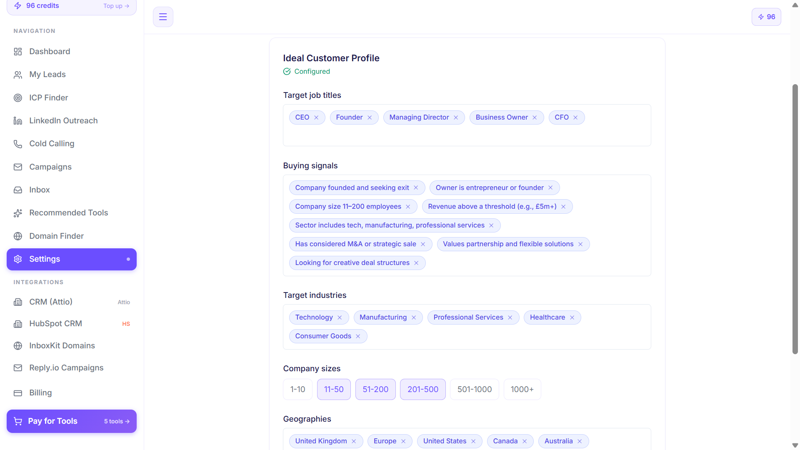
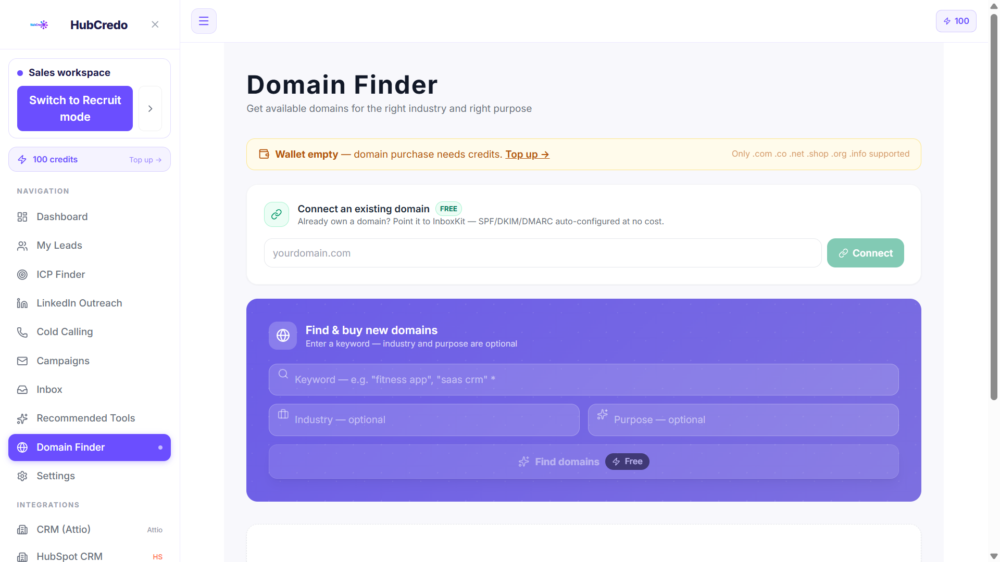

# HubCredo — Your AI-Powered Sales Pipeline, Built in Minutes

**Live Website:** [https://pipeline.hubcredo.com/](https://pipeline.hubcredo.com/)

## What is HubCredo?

Finding new customers is one of the hardest parts of running a business. Most companies end up juggling 6 or more different tools — one for finding leads, another for emails, another for LinkedIn messages — and spend weeks (and thousands of dollars) just to get their first sales campaign running.

**HubCredo removes all of that hassle.**

You simply share your company website, and HubCredo automatically builds your entire sales outreach system for you — who to target, where to find them, and how to reach them — all from one simple dashboard.

Think of it as a **complete, ready-to-use sales team in a box**, powered by AI.

---

## How It Works (In Plain English)

### Step 1: Share Your Website
Just paste your website link. Our AI reads your website in seconds and understands what your business does, who it's for, and what makes it different — no forms, no manual data entry.

### Step 2: Get Your Ideal Customer Profile (ICP)
Based on your website, HubCredo automatically figures out exactly **who your best customers are** — their industry, company size, job titles, and pain points. This is normally something businesses pay consultants thousands of dollars to work out.

### Step 3: Get Real Leads — With Emails & LinkedIn Profiles
Once we know your ideal customer, HubCredo finds **real, verified people** who match that profile — complete with their **email address and LinkedIn profile**, ready for you to contact.

### Step 4: Reach Out — On Email and LinkedIn
HubCredo doesn't just find leads, it helps you **contact them**:
- **Email Outreach** — automatically send and track outreach emails
- **LinkedIn Outreach** — send and track LinkedIn connection requests and messages

### Step 5: Track Everything From One Dashboard
Every lead, every email, every LinkedIn message, and every reply is tracked in one clean, easy-to-read dashboard — so you always know exactly where your sales pipeline stands.

---

## Key Features

| Feature | What It Does For You |
|---|---|
| 🎯 **AI-Powered ICP (Ideal Customer Profile)** | Automatically tells you *who* to sell to, based on your website — no guesswork. |
| 👥 **Lead Generation** | Finds real, verified leads that match your ideal customer, complete with **email addresses and LinkedIn profiles**. |
| 🌐 **Domain Finder** | Instantly discovers company domains/websites tied to your leads and target companies. |
| 💼 **LinkedIn Outreach** | Send connection requests and messages to your leads directly on LinkedIn, and track replies. |
| 📧 **Email Outreach** | Send and track cold email campaigns to your leads, with open and reply tracking. |
| 📊 **Simple Dashboard** | See your total leads, active campaigns, messages sent, and replies — all in one place. |

---

## Why Businesses Choose HubCredo

- ⏱️ **Saves Time** — What normally takes months of research and setup happens in minutes.
- 💰 **Saves Money** — No need to hire consultants or pay for 6+ separate subscriptions.
- 🧩 **No Technical Skill Needed** — If you can type a website address, you can use HubCredo.
- 🔗 **Everything Connected** — Lead finding, email, and LinkedIn outreach all work together instead of being scattered across different tools.

---

## Who Is This For?

- **Founders & Small Business Owners** who want a steady stream of new customers without hiring a sales team.
- **B2B Companies** that need a reliable, repeatable way to find and reach decision-makers.
- **Sales & Marketing Agencies** managing outreach for multiple clients.
- **Anyone tired of paying for and managing 6 different sales tools** that don't talk to each other.

---

## See It In Action

👉 Visit the live product here: **[https://pipeline.hubcredo.com/](https://pipeline.hubcredo.com/)**

---
